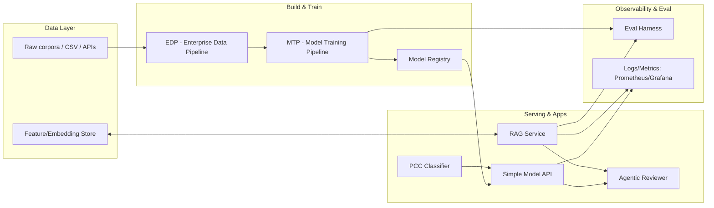
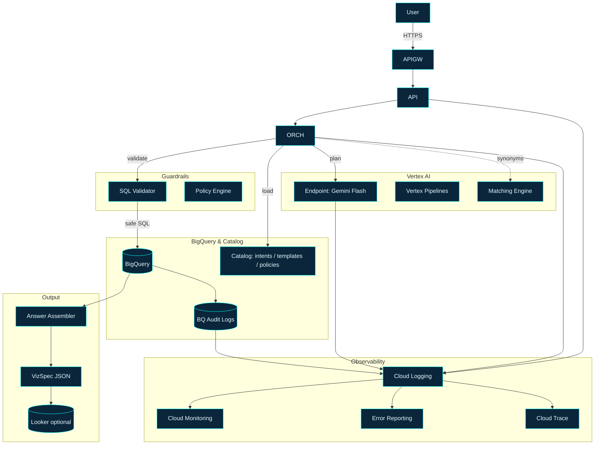
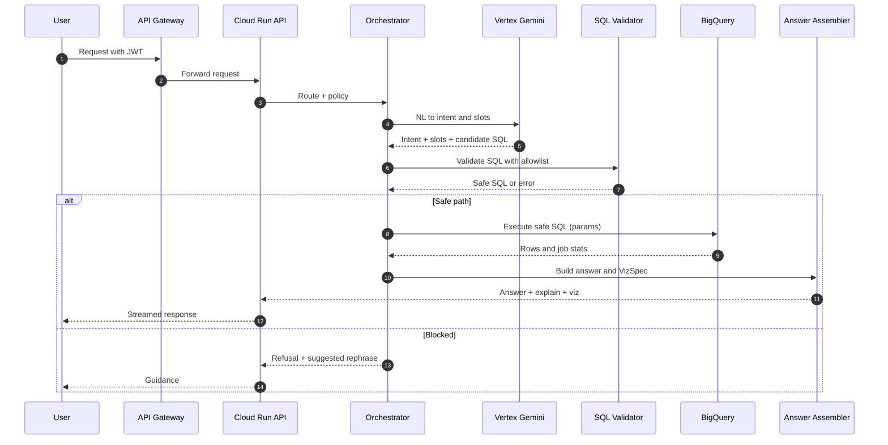
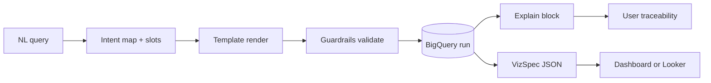
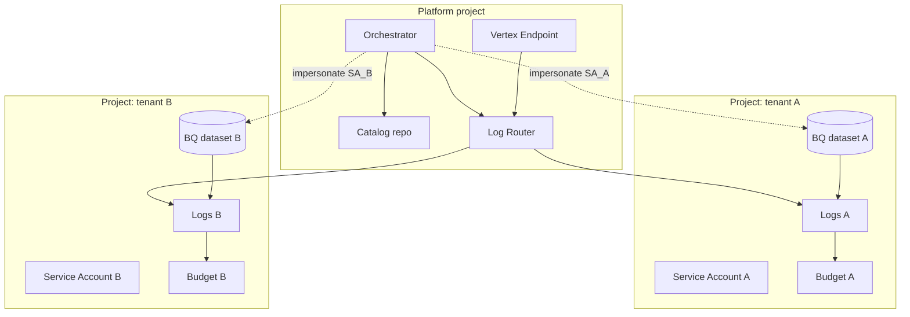
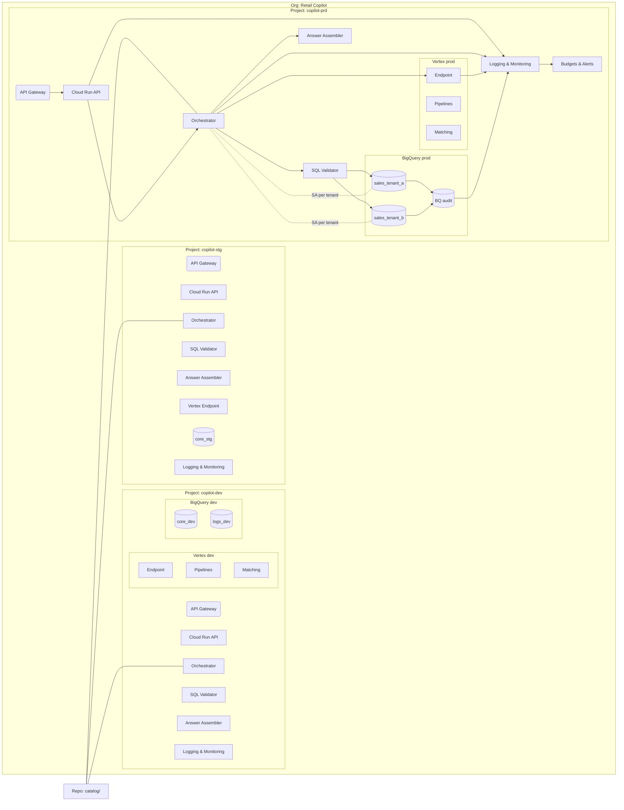

# Alejandro Garay — AI Solutions Architect (NLP/RAG/Agentic)

**I design, ship, and evaluate end‑to‑end AI systems** with a focus on NLP: retrieval‑augmented generation (RAG), agentic workflows, evaluation harnesses, and production patterns at individual scale. This repo is the **entry point** to my portfolio: code, diagrams, and evidence.

**Last updated:** 2025‑11‑20

---

## At a glance

* **Primary vector:** AI/ML **Solutions Architect** (NLP‑heavy: RAG, agents, finetuning/evals)
* **Differentiator:** symbolic‑linguistic rigor + production patterns (pipelines, orchestration, testing, monitoring) rather than demo‑only prototypes
* **Background:** Linguistics/Philosophy/Translation → AI/NLP (retrieval‑first, auditable systems)
* **Proof mindset:** every featured project exposes **Quickstart → Metrics → Logs** so reviewers can verify claims in minutes

> Short link to share: `github.com/naaas94/portfolio`

---

## Hiring signals (pattern → evidence)

| Real‑world pattern                             | What I built                      | Evidence                                                             | First file to open                                                 |
| ---------------------------------------------- | --------------------------------- | -------------------------------------------------------------------- | ------------------------------------------------------------------ |
| Ingestion → Train → Evaluate → Serve → Monitor | **Model Training Pipeline (MTP)** | CI badge, MLflow runs, deterministic seeds, latency & cost snapshots | `mtp/README.md` → `examples/minimal_run.py`                        |
| RAG with retrieval quality gates               | **Lightweight RAG Service**       | recall@k, precision@k, answer faithfulness, context‑utilization      | `rag-service/README.md` → `scripts/eval_rag.py`                    |
| Post‑hoc guardrails/verification               | **Agentic Reviewer**              | hallucination checks, citation verification, rubric‑based scoring    | `agentic-reviewer/README.md` → `examples/review_demo.ipynb`        |
| Productionized text classification             | **Privacy Case Classifier (PCC)** | F1/accuracy with data slices; confusion matrix; error analysis       | `pcc/README.md` → `notebooks/pcc_demo.ipynb`                       |
| Observability for LLM APIs                     | **Simple Model API (SMA)**        | Prometheus metrics (RPS, P50/P95), structured logs, k6 load test     | `simple-model-api/README.md` → `make loadtest`                     |
| Embedding analysis & migration                 | **Embedding Mapper**              | pairwise shifts, trust‑region plots, retrieval deltas                | `embedding-mapper/README.md` → `examples/compare_embeddings.ipynb` |
| NL→SQL with safety & tenancy                   | **Retail Copilot**                | Intent taxonomy, SQL templates, validation rules, golden‑set evals   | `retail-copilot/docs/dossier.pdf` → `catalog/intents.yaml`        |

---

## Architecture (portfolio map)



* Diagram asset: `/docs/architecture.png` (PNG export); source: `/docs/architecture.mmd` (Mermaid)

---

## Evaluation (RAG/LLM + systems)

**Retrieval metrics**

* `recall@k`: fraction of queries where at least one gold doc is in top‑k.
* `precision@k`: fraction of top‑k that are relevant.
* `MRR@k`: mean reciprocal rank of first relevant doc within k.
* `nDCG@k`: graded relevance with position discount.

**Answer‑level metrics**

* **Faithfulness**: proportion of claims grounded in retrieved context (LLM‑ or rule‑based).
* **Context utilization**: % of answer tokens attributable to provided context.
* **Answer correctness**: labeling via gold answers or rubric (exact/partial match).

**Operational**

* **Latency** `P50/P95`, **throughput** `RPS`, **cost/request**, **timeouts/error rate**, and **SLO/error budget** (e.g., `P95 < 800ms`, monthly error budget 0.5%).

Each featured repo ships an `eval/` folder with scripts + JSON logs compatible with the shared dashboard panels in `observability/`.

---

## Observability

* **Stack:** `prometheus`, `grafana`, `opencensus` (exporters), structured JSON logs.
* Dashboards: `/observability/grafana/provisioning/` (panels for latency, RPS, errors, cost).
* Alerts: `/observability/alerts/` (ex: high P95, elevated 5xx, drift detector fired).
* Screenshots for reviewers: `/docs/img/observability_*.png`.

Run locally:

```bash
make up-metrics   # Grafana on http://localhost:3000 (admin/admin locally)
```

---

## Featured projects

### 1) Retail Copilot NL→SQL Architecture (GCP/Vertex)

* **Problem**: convert natural language queries into validated SQL + VizSpec JSON over BigQuery with safe multi‑tenant execution.
* **Pattern**: NL→intent→slots→template→validator chain; spec‑first architecture with PoC→MVP→multi‑tenant evolution path.
* **Implementation**: 35+ page architecture dossier; planner JSON, SQL templates, validation rules, tenant isolation (RLS/CLS, per‑tenant datasets/budgets), golden‑set eval, promotion gates.
* **Evidence**: Intent taxonomy, glossary, SQL policies, router/planner prompts, test scaffolds, runbook, monitoring dashboards, SLOs (latency, cost, faithfulness), canary rollout specs.
* **Start here**: `retail-copilot/docs/dossier.pdf` → `catalog/intents.yaml` → `prompts/planner-retail-v2.md`
* **Status**: Architecture/spec delivered — 2025

#### Architecture diagrams

**System context (at a glance)**



**Request flow (sequence)**



**Data lineage (from NL to Viz)**



**Multi-tenant isolation (execution + logs + budgets)**



**Deployment topology (projects, services, IAM)**



### 2) PCC — Privacy Case Classifier

* **Problem**: classify privacy requests/cases into workflow buckets (GDPR/CCPA compliance).
* **Pattern**: supervised text classification + error analysis + data slices; policy‑to‑pipeline translation.
* **Implementation**: `scikit-learn`/Transformers (MiniLM), Flyte orchestration, BigQuery, Docker, MLflow runs.
* **Evidence**: macro‑F1 on fixtures; slice metrics (by entity/type); confusion matrix; regulatory constraint mapping.
* **Start here**: `pcc/notebooks/pcc_demo.ipynb`
* **Status**: In progress — 2025‑10

### 3) MTP — Model Training Pipeline

* **Problem**: reproducible training with experiment tracking & registries.
* **Pattern**: `MLflow` + deterministic training + pinned deps + structured configs.
* **Implementation**: Makefile targets (`make train/eval/register`), CI, Docker multi‑stage.
* **Evidence**: MLflow artifacts, metrics tables, model in `registry/`.
* **Start here**: `mtp/examples/minimal_run.py`
* **Status**: Stable — 2025‑10

### 4) SMA — Simple Model API

* **Problem**: serve models with SLAs and visibility.
* **Pattern**: FastAPI + Prometheus + k6 load test + JSON logs.
* **Implementation**: `docker-compose up`, `/metrics` endpoint, request IDs, middleware timing.
* **Evidence**: P50/P95 latency charts; RPS under load; error rates.
* **Start here**: `simple-model-api/README.md` → `make loadtest`
* **Status**: Stable — 2025‑10

---

## More projects

* **RAG Service** — retrieval + rerank + prompt templates + eval harness (`recall@k`, faithfulness). Built for Spotify internal knowledge search with transformer embeddings + FAISS, freshness policies.
* **Agentic Reviewer** — post‑hoc auditing loop (citation checks, rubric scores, red‑team prompts). Symbolic‑LLM hybrid for systematic agent performance evaluation.
* **Embedding Mapper** — compare embedding models; visualize drift and retrieval deltas.
* **EDP (Enterprise Data Pipeline)** — ingestion/validation to dataset release with schema contracts. Stack: Apache Beam, Spark, Ray, Kafka.

Each has: Quickstart, config examples, and `eval/` outputs.

---

## Operating standards (applies to all repos)

* [x] Pinned dependencies & lockfiles
* [x] Deterministic seeds & reproducible runs
* [x] Makefile targets for common actions
* [x] CI: lint (`ruff`), typecheck (`mypy`/`pyright`), tests (`pytest`)
* [x] Structured logs + metrics hooks
* [x] Minimal data fixtures checked into repo
* [x] Doc: Quickstart + E2E path ≤10 minutes

---

## About me

I come from **linguistics/philosophy/translation** (B.Sc. Technical‑Scientific Translation, B.Ed. English Language Teaching). I use that symbolic lens to design reliable NLP systems: clear problem framing, careful retrieval/representation choices, and evaluation you can trust.

Most recently at **Spotify** (Sep 2024 – Jul 2025) as Data Scientist on Customer Experience & Privacy, where I architected privacy‑compliant NLP pipelines, delivered semantic retrieval capabilities, and partnered with Legal/Ops to turn policy into system guarantees.

Currently based in **Buenos Aires, Argentina**.

* **GitHub:** [github.com/naaas94](https://github.com/naaas94)
* **LinkedIn:** [linkedin.com/in/alejandroa-garay](https://www.linkedin.com/in/alejandroa-garay/)
* **Email:** alejandroa.garay.ag@gmail.com
